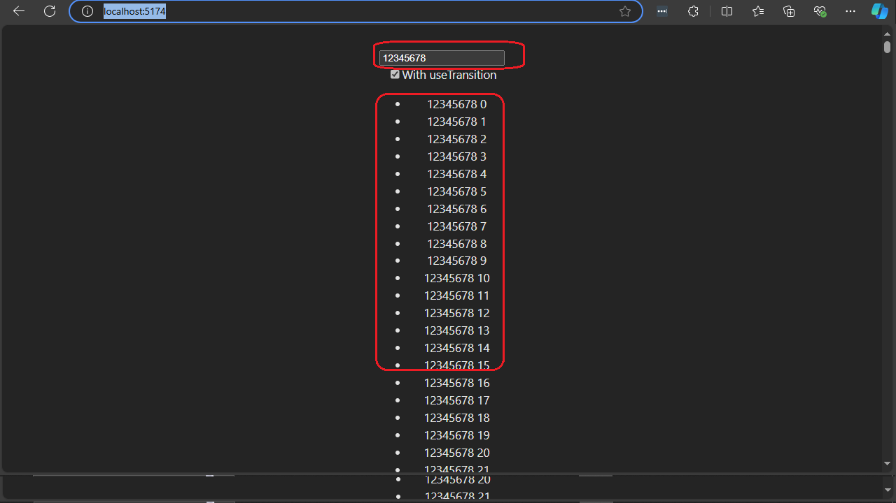

<h2 id="project-description">Project Description</h2>
<p>A simple usage of <code>useTransition</code> in a React project. You can toggle between using <code>useTransition</code> or not and see the effect on the user experience when entering text into an input field. By using <code>useTransition</code>, we give lower priority to rendering a long list, which otherwise causes sluggish text input.</p>

<h2 id="motivation">Motivation</h2>
<p><code>useTransition</code> is a React hook introduced in React 18 that defers state updates to keep the UI responsive during heavy rendering. This project's purpose is to demonstrate how to use it effectively.</p>


<h2 id="installation">Installation</h2>
<p>Use the following command to install the project packages:</p>
  <pre><code>pnpm i</code></pre>
<p><code>npm</code> is also possible.</p>


<h2 id="usage">Usage</h2>
<p>This section provides instructions on how to run and use the project. 
Follow the steps below to get started:</p>

<h3>Invocation</h3>
<p>Use the following command to run the development server:</p>

```bash
npm run dev
```

<h3>Basic Usage of <code>useTransition</code></h3>

```ts
  const [isPending, startTransition] = useTransition();
```

<p><code>useTransition()</code> is a React hook that returns an array with two elements:</p>
<ul>
    <li><strong>isPending</strong>: A boolean that tells you if the transition is ongoing. If it’s true, the UI is currently waiting for the transition to finish.</li>
    <li><strong>startTransition</strong>: A function used to wrap your state updates that should be marked as transitions. When you call this function with your updates inside it, React will handle those updates with lower priority, ensuring the UI remains responsive.</li>
</ul>


<h3>Using <code>startTransition</code></h3>
<p>We define <code>updateList</code> as a transition, meaning it will have lower priority when rendering the UI, giving higher priority to user input.</p>

```ts
  const handleChange = (e: ChangeEvent<HTMLInputElement>) => {
    const value = e.target.value;
    setInput(value);
    const updateList = () => {
      const newList = Array.from(
        { length: ITEM_IN_LONG_LIST },
        (_, index) => `${value} ${index}`
      );
      setLongList(newList);
    };

    if (useTransitionToggle) {
      startTransition(updateList);
    } else {
      updateList();
    }
  };
```

<h3>Using isPending</h3>
<p><code>isPending</code> is used to show a transition loading message while <code>longList</code> is rendering.</p>
```ts
    <div>
      <input 
        type="text" value={input} 
        onChange={handleChange} placeholder="Type something..."/>
      {isPending && <p>Loading...</p>}
      <div>
        <label>
          <input
            type="checkbox" checked={useTransitionToggle}
            onChange={() => setUseTransitionToggle(!useTransitionToggle)}
          />
          With useTransition
        </label>
      </div>
      <ul>{longList.map((item, index) => (<li key={index}>{item}</li>))}</ul>
    </div>
```

<h2 id="code-structure">Code Structure</h2>
<p><code>App</code> is a component that uses <code>useTransition</code>.</p>

<h2 id="demo">Demo</h2>

<p>Below is a figure of the UI of the <code>App</code> component. Type into the input and see the list below rendering. Try this yourself and observe the following:</p>

<ul>
    <li>When the checkbox is checked, <code>useTransition</code> is used, and you will see that the UI is very responsive to user inputs.</li>
    <li>When the checkbox is unchecked, <code>useTransition</code> is not used, and you will see that the UI is very sluggish for user inputs.</li>
</ul>

<p>In particular, this is evident after you type <code>12345678</code>, mark it, and erase it in one click - try it for yourself.</p>



<h2 id="points-of-interest">Points of Interest</h2>
<ul>
    <li><code>useTransition</code> helps in scenarios where you want to keep the UI responsive while deferring non-urgent state updates, but it won't handle CPU-intensive tasks directly.</li>
    <li>The React 19 hook <code>useServerAction</code> uses <code>useTransition</code> internally.</li>
</ul>


<h2 id="references">References</h2>
<ul>
    <li>The following is a <a href='https://react.dev/reference/react/useTransition'>link</a> from the react documnration in useTransition</li>
</ul>

